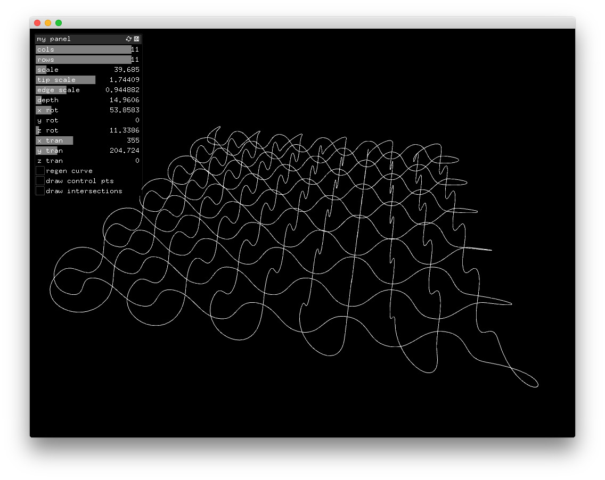

# generateCurves
An Endless knot generator in C++/openFrameworks with Midi Control

uses:
- ofxCurve (found in [gallery-tools](https://github.com/camb416/gallery-tools))
- [ofxMidi](https://github.com/danomatika/ofxMidi)
